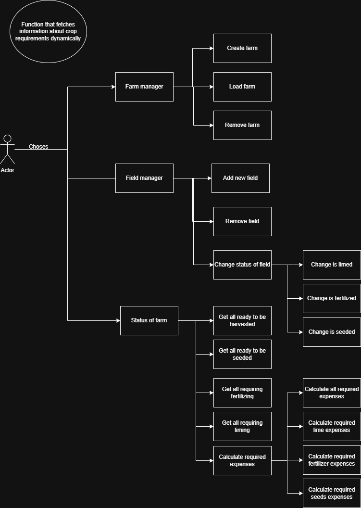

# Farm Management Tool

## Overview
The Farm Management Tool is a Java application designed to help farmers manage their fields, crops, and overall farm operations efficiently. It allows users to track the growth stages of crops, manage farm areas, and maintain records of various farm activities.

## Features
- Create and manage farms
- Add and manage fields
- Track crop growth stages
- Calculate total area of the farm
- Display farm summaries

## Architecture

